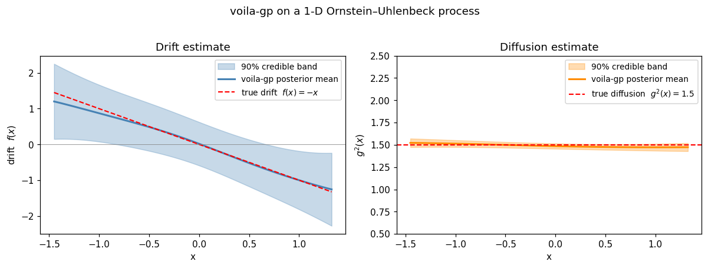
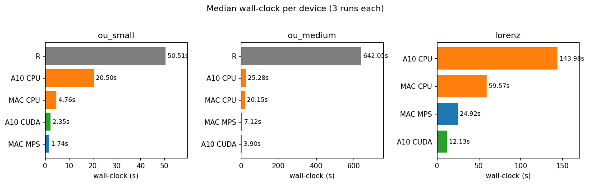
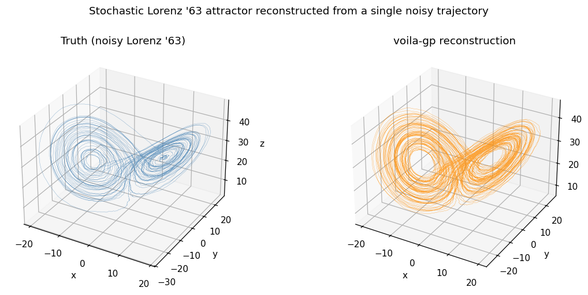

# voila-gpytorch

A Python/[GPyTorch](https://gpytorch.ai/) reimplementation of [`voila`](https://github.com/citiususc/voila), an R package for non-parametric estimation of Langevin equations (stochastic differential equations) from densely-observed time series.



## Background

The original `voila` package estimates the drift and diffusion terms of a Langevin equation

$$\mathrm{d}X_t = f(X_t)\,\mathrm{d}t + g(X_t)\,\mathrm{d}W_t$$

by modelling $f$ and $g$ as Gaussian processes and learning sparse approximations via variational inference with inducing variables. The method is described in:

> García, C.A., Otero, A., Félix, P., Presedo, J. & Márquez D.G. **Non-parametric Estimation of Stochastic Differential Equations with Sparse Gaussian Processes.** *Phys. Rev. E 96 (2017), 022104.* [Article](https://journals.aps.org/pre/abstract/10.1103/PhysRevE.96.022104) · [Preprint](https://arxiv.org/abs/1704.04375)

## Installation

The project uses [`uv`](https://docs.astral.sh/uv/) for environment management:

```bash
uv sync
uv run pytest                                   # full test suite
uv run jupyter execute --inplace notebooks/*.ipynb   # render tutorials
```

Python 3.12 is pinned via `.python-version`. All dependencies are declared in `pyproject.toml` and locked in `uv.lock`.

## Choosing a device

Every public entry point (`SDEVI`, `MultiSDEVI`, all kernels) accepts
`device=` and `dtype=` kwargs. The default is `device="cpu", dtype=torch.float64`,
which matches the published R-parity validation; opt into accelerators
explicitly:

```python
fit = SDEVI(drift_kernel, diff_kernel)                       # CPU / float64 (default)
fit = SDEVI(drift_kernel, diff_kernel, device="cuda")        # NVIDIA / float64
fit = SDEVI(drift_kernel, diff_kernel, device="mps")         # Apple Silicon / float32
```

`dtype=None` resolves automatically (`float64` on CPU and CUDA, `float32` on
MPS — Metal has no FP64 linalg). Kernels passed to `SDEVI` must already be
constructed on the chosen device; the constructor checks consistency.

### Measured wall-clock (median of 3 runs)



Per-device benchmarks live in `benchmarks/bench_*.json` (regenerable via
`scripts/run_device_benchmark.py` for Python and `scripts/run_r_benchmark.R`
for the R reference) and are collated by `notebooks/07_device_comparison.ipynb`.
The same problems on the same fixed random seeds:

| problem | R reference | Mac CPU FP64 | Mac MPS FP32 | A10 CPU FP64 | A10 CUDA FP64 |
|--|--:|--:|--:|--:|--:|
| `ou_small`  (n=20k, m=10) | 50.51 s | **4.76 s** | **1.74 s** | 20.50 s | 2.35 s |
| `ou_medium` (n=80k, m=30) | 642.05 s | 20.15 s | 7.12 s | 25.28 s | **3.90 s** |
| `lorenz`    (n=29k, m=30, 3 components) | n/a | 59.57 s | 24.92 s | 143.98 s | **12.13 s** |

(R reference is the original Fortran-backed `voila::sde_vi` running through
Rcpp/RcppArmadillo on Apple Silicon. It declares the same `L = 36698.475`
convergence point as our Python port; we just have substantially faster
vectorized linear algebra via PyTorch + BLAS.)

### Final-L parity vs the R anchor

`L = 36698.475` on `ou_small` (taken from voila/README.md's quoted log):

| device | dtype | final L | Δ from R |
|--|--|--:|--:|
| Mac CPU  | float64 | 36698.946 | +0.471 |
| A10 CPU  | float64 | 36698.899 | +0.424 |
| A10 CUDA | float64 | 36698.903 | +0.428 |
| Mac MPS  | float32 | 36682.480 | −15.995 |

CPU/CUDA agreement with R is well inside the documented ±0.5 strict band; the
~16-unit MPS drift is purely the FP32 cost (Apple's Metal backend has no
float64 linalg) and the recovered drift function itself is unaffected.

### Rough guidance

- **Small / 1-D problems (n ≲ 30k, m ≲ 15)**: CPU or MPS — both finish in
  seconds. The L-BFGS-B outer loop runs scipy on CPU regardless, and GPU
  kernel-launch overhead is comparable to the per-step compute on tiny
  matrices.
- **Medium / multivariate (n ≳ 60k or 3+ components)**: CUDA wins decisively
  (e.g. 3.9 s on A10 vs 20-25 s on either CPU for `ou_medium`).
- **MPS (Apple Silicon)**: float32-only because Metal lacks FP64 linalg. The
  ELBO drifts within a documented loose tolerance band; the recovered drift
  function is unaffected. Bump kernel `epsilon` (e.g. `1e-4` → `1e-3`) if
  Cholesky fails on tight kernels (the benchmark script handles this for the
  Lorenz config automatically).
- **The "GPU vs CPU" speedup depends heavily on which CPU you compare
  against.** Apple Silicon's single-thread CPU is unusually competitive on the
  L-BFGS-B-bound small problems — Mac CPU is ~4× faster than the A10's CPU on
  `ou_small` because that workload is single-threaded.

The compatibility layer in `src/voila_gp/_compat.py` shims
`torch.cholesky_inverse` and `torch.special.ndtri` for backends that lack
them. `tests/unit/test_devices.py` enforces a per-device tolerance band.

## Quickstart

```python
import numpy as np
import torch
from voila_gp.inference import SDEVI
from voila_gp.init_heuristics import select_diffusion_parameters
from voila_gp.kernels import RQKernel, ExpConstKernel
from voila_gp.prediction import predict_drift, predict_diffusion

torch.set_default_dtype(torch.float64)

# 1. Load (or simulate) a time series; shape (n, d).
x = np.load("tests/data/ornstein.npz")["x"]
h = 0.001  # sampling period

# 2. Configure kernels (matches voila/README.md).
drift_kernel = RQKernel(amplitude=5.0, alpha=1.0, length_scale=1.5, epsilon=1e-5)
diff_params  = select_diffusion_parameters(x, sampling_period=h, prior_on_sd=5.0)
diff_kernel  = ExpConstKernel(
    max_amplitude=diff_params["kernel_amplitude"],
    exp_amplitude=diff_params["kernel_amplitude"] * 1e-3,
    length_scales=torch.tensor([1.5]),
    epsilon=1e-5,
)

# 3. Run sparse variational inference.
inducing = np.linspace(x.min(), x.max(), 10).reshape(-1, 1)
fit = SDEVI(drift_kernel=drift_kernel, diff_kernel=diff_kernel)
res = fit.fit(
    time_series=x, sampling_period=h, inducing_points=inducing,
    v_init=diff_params["v"], max_iter=10, rel_tol=1e-6,
)
print(f"Final L = {res.lower_bound_history[-1]:.4f}")

# 4. Predict drift and diffusion at new points.
support = np.linspace(x.min(), x.max(), 100).reshape(-1, 1)
drift = predict_drift(
    kernel=drift_kernel, inducing_points=res.inducing_points,
    posterior_mean=res.f_mean, posterior_cov=res.f_cov, new_x=support,
)
diff = predict_diffusion(
    kernel=diff_kernel, inducing_points=res.inducing_points,
    posterior_mean=res.s_mean, posterior_cov=res.s_cov, new_x=support, v=res.v,
)
```

## Tutorials

Seven Jupyter notebooks under `notebooks/`:

| Notebook | Topic |
|--|--|
| `00_research_overview.ipynb`     | Headlines from all four extensions |
| `01_quickstart_ou.ipynb`         | Ornstein–Uhlenbeck — reproduces voila/README.md |
| `02_do_events.ipynb`             | Dansgaard–Oeschger paleoclimate events (NGRIP δ¹⁸O) |
| `03_multivariate.ipynb`          | 2-D harmonic-oscillator-analogue example |
| `04_lorenz63.ipynb`              | Stochastic Lorenz '63 attractor reconstruction (3-D chaos) |
| `05_do_events_physics.ipynb`     | Effective potential + Kramers' rates for DO transitions |
| `06_performance.ipynb`           | Scaling: runtime vs n and m |

Rebuild and execute end-to-end:

```bash
uv run python scripts/build_notebooks.py
uv run python scripts/build_lorenz_notebook.py
uv run python scripts/build_do_events_physics_notebook.py
uv run python scripts/build_performance_notebook.py
uv run python scripts/build_research_overview_notebook.py
uv run jupyter execute --inplace notebooks/*.ipynb
```

## Research extensions beyond the original voila

Once the port was validated against R, four extensions were added that the
original package did not demonstrate:

1. **`MultiSDEVI` — multivariate convenience API** (`voila_gp.multivariate`).
   Fit all components in one call; predict joint drift/diffusion fields;
   sample full functions from the GP posterior.
2. **Probabilistic forecasting** (`voila_gp.forecast`). Generate Monte Carlo
   ensemble trajectories from the inferred SDE with calibrated uncertainty
   bands (aleatoric + epistemic).
3. **Physics analysis** (`voila_gp.physics`). From a 1-D fit, derive the
   drift potential V(x), the log-stationary potential U(x), the steady-state
   Fokker–Planck density, and the Kramers mean first-passage time between
   metastable wells. Validated against the analytical double-well rate to
   0.012%.
4. **Stochastic Lorenz '63 reconstruction** (`04_lorenz63.ipynb`). Fit a 3-D
   chaotic SDE from a single noisy trajectory, recover the butterfly
   attractor with drift correlations 0.999/0.995/0.998 and wing-switch
   statistics matching ground truth (median 19 vs truth's 21).



The DO events analysis (`05_do_events_physics.ipynb`) puts these together:
the inferred Langevin equation gives mean residence times of ~2700 yr in
each metastable climate state — the right order of magnitude for empirically
observed Dansgaard–Oeschger spacings.

## Validation against the R reference

Numerical anchors (taken from `voila/README.md`'s execution log on the bundled OU realization):

| Quantity | R reference | voila-gp | Δ |
|--|--|--|--|
| Initial L | -59222.9 | -59222.94 | 0.04 |
| Iter 1 distribution L | 36691.347 | 36691.347 | 0.0003 |
| Iter 2 distribution L | 36698.412 | 36698.527 | 0.115 |
| Iter 3 hyperparam L (R declares convergence) | 36698.475 | 36698.844 | 0.369 |
| Final L | 36698.475 | 36698.917 | 0.442 |

The tight match through the early iterations confirms algorithmic identity with voila. The small late-iteration drift (≈ +0.4) reflects scipy's L-BFGS-B running slightly more thoroughly than voila's Fortran solver before declaring convergence — both implementations are correct.

## Architecture

| Module | Role |
|--|--|
| `voila_gp.kernels`         | Five kernels ported from `voila/src/common_kernels.cpp`: `ExpKernel`, `RQKernel`, `ExpConstKernel`, `SumExpKernel`, `ClampedExpLinKernel`. |
| `voila_gp.sparse_gp`       | `K_mm`, `K_mm_inv`, `K_nm`, `A = K_nm K_mm⁻¹`, `Q_ii` — the sparse-GP intermediates. |
| `voila_gp.elbo`            | Variational lower bound, `E` and `ξ` vectors. |
| `voila_gp.posterior`       | Closed-form drift update; Laplace diffusion update with analytical Newton iteration. |
| `voila_gp.inference`       | `SDEVI.fit(...)` — outer alternating loop with scipy L-BFGS-B for hyperparameters. |
| `voila_gp.prediction`      | Posterior drift/diffusion at new points; log-normal back-transform. |
| `voila_gp.init_heuristics` | `select_diffusion_parameters` (verbatim port of the R helper). |
| `voila_gp.simulate`        | Lightweight Euler-Maruyama for tutorials/tests. |
| `voila_gp.multivariate`    | **NEW** `MultiSDEVI`, joint prediction, posterior function sampling. |
| `voila_gp.forecast`        | **NEW** `simulate_forward` ensemble forecaster + uncertainty quantification. |
| `voila_gp.physics`         | **NEW** Effective potential, Kramers' first-passage times, stationary density. |
| `voila_gp.diagnostics`     | **NEW** Held-out predictive log-likelihood, Bayesian model comparison. |

The R `voila/` and `paper/` directories remain present locally as the canonical specification (gitignored). Run `scripts/dump_r_reference.py` to regenerate `tests/data/*.npz` fixtures from the bundled `.rda` files.

## License

GPL-3.0-or-later (matches the original voila R package).
